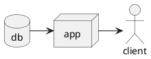

# Kramdown::PlantUml

[![Gem Version][gem-badge]][gem-url]
![Build][build-badge]
![No Java][no-java-build-badge]
![No PlantUML][no-plantuml-badge]
[![License][license-badge]][license]
[![Dependabot Status][dependabot-badge]][dependabot]
[![CLA assistant][cla-badge]][cla]
[![Contributor Covenant][coc-badge]][coc]

`kramdown-plantuml` allows you to use [PlantUML][plantuml] syntax within [fenced
code blocks][fenced] in [Jekyll] with its default [Kramdown][kramdown] Markdown
parser:

````md

````

Using the `plantuml` language identifier in fenced code blocks will allow
`kramdown-plantuml` to pick it up and replace it with a rendered [SVG][svg]
diagram when the Markdown is rendered to HTML. The above diagram will be
replaced with the following (abbreviated) HTML code:

```html
<div class="plantuml">
  <svg>
    <!-- Snip converted SVG code -->
  </svg>
</div>
```

Which in place will be rendered as the following:

![Rendered SVG Diagram][diagram-svg]

## Installation

Add this line to your application's Gemfile:

```ruby
gem 'kramdown-plantuml'
```

And then execute:

```sh
bundle install
```

Or install it yourself as:

```sh
gem install kramdown-plantuml
```

And then add the following to your Jekyll site's `_config.yml` file:

```yaml
plugins:
  - "kramdown-plantuml"
```

Then, `bundle exec jekyll build` or `bundle exec jekyll serve` will execute
`kramdown-plantuml`, converting code fenced PlantUML diagrams to beautiful
SVG.

## Development

After checking out the repo, run `bin/setup` to install dependencies. You can
also run `bin/console` for an interactive prompt that will allow you to
experiment.

To install this gem onto your local machine, run `bundle exec rake install`. To
release a new version, update the version number in `version.rb`, and then run
`bundle exec rake release`, which will create a git tag for the version, push
git commits and tags, and push the `.gem` file to [rubygems.org][gems].

## Contributing

Bug reports and pull requests are welcome on [GitHub][github]. This project is
intended to be a safe, welcoming space for collaboration, and contributors are
expected to adhere to the [code of conduct][coc] and sign the
[contributor's license agreement][cla].

## License

The code within this repository is available as open source under the terms of
the [Apache 2.0 License][license] and the [contributor's license
agreement][cla].

[build-badge]:          https://github.com/SwedbankPay/kramdown-plantuml/workflows/Ruby%20Gem/badge.svg?branch=master
[cla-badge]:            https://cla-assistant.io/readme/badge/SwedbankPay/kramdown-plantuml
[cla]:                  https://cla-assistant.io/SwedbankPay/kramdown-plantuml
[coc-badge]:            https://img.shields.io/badge/Contributor%20Covenant-v2.0%20adopted-ff69b4.svg
[coc]:                  ./CODE_OF_CONDUCT.md
[dependabot-badge]:     https://api.dependabot.com/badges/status?host=github&repo=SwedbankPay/kramdown-plantuml
[dependabot]:           https://dependabot.com
[diagram-svg]:          ./spec/diagram.svg
[fenced]:               https://www.markdownguide.org/extended-syntax/#syntax-highlighting
[gem-badge]:            https://badge.fury.io/rb/kramdown-plantuml.svg
[gem-url]:              https://rubygems.org/gems/kramdown-plantuml
[gems]:                 https://rubygems.org
[github]:               https://github.com/SwedbankPay/kramdown-plantuml/
[jekyll]:               https://jekyllrb.com/
[kramdown]:             https://kramdown.gettalong.org/
[license-badge]:        https://img.shields.io/github/license/SwedbankPay/kramdown-plantuml
[license]:              https://opensource.org/licenses/Apache-2.0
[no-java-build-badge]:  https://github.com/SwedbankPay/kramdown-plantuml/workflows/No%20Java/badge.svg?branch=master
[no-plantuml-badge]:    https://github.com/SwedbankPay/kramdown-plantuml/workflows/No%20PlantUML/badge.svg?branch=master
[plantuml]:             https://plantuml.com/
[svg]:                  https://developer.mozilla.org/en-US/docs/Web/SVG
