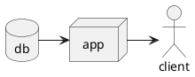

# Kramdown::PlantUml

[![Contributor Covenant][coc-badge]][coc]
![Build][build-badge]
![No Java][no-java-build-badge]
![No PlantUML][no-plantuml-badge]

`kramdown-plantuml` allows you to use [PlantUML][plantuml] syntax within [fenced
code blocks][fenced] in [Jekyll] with its default [Kramdown][kramdown] Markdown
parser:

````md

````

Using the `plantuml` language identifier in fenced code blocks will allow
`kramdown-plantuml` to pick it up and replace it with a rendered [SVG][svg]
diagram when the Markdown is rendered to HTML. The above diagram will be
replaced with the following:

![Rendered SVG Diagram][diagram-svg]

## Installation

Add this line to your application's Gemfile:

```ruby
gem 'kramdown-plantuml'
```

And then execute:

```sh
bundle install
```

Or install it yourself as:

```sh
gem install kramdown-plantuml
```

## Development

After checking out the repo, run `bin/setup` to install dependencies. You can
also run `bin/console` for an interactive prompt that will allow you to
experiment.

To install this gem onto your local machine, run `bundle exec rake install`. To
release a new version, update the version number in `version.rb`, and then run
`bundle exec rake release`, which will create a git tag for the version, push
git commits and tags, and push the `.gem` file to [rubygems.org][gems].

## Contributing

Bug reports and pull requests are welcome on [GitHub][github]. This project is
intended to be a safe, welcoming space for collaboration, and contributors are
expected to adhere to the [code of conduct][coc].

## License

The gem is available as open source under the terms of the [MIT License][mit].

## Code of Conduct

Everyone interacting in the Kramdown::PlantUml project's codebases, issue trackers, chat rooms and mailing lists is expected to follow the [code of conduct](https://github.com/[USERNAME]/kramdown-plantuml/blob/master/CODE_OF_CONDUCT.md).

[plantuml]: https://plantuml.com/
[jekyll]: https://jekyllrb.com/
[kramdown]: https://kramdown.gettalong.org/
[gems]: https://rubygems.org
[github]: https://github.com/SwedbankPay/kramdown-plantuml/
[coc]: CODE_OF_CONDUCT.md
[coc-badge]: https://img.shields.io/badge/Contributor%20Covenant-v2.0%20adopted-ff69b4.svg
[mit]: https://opensource.org/licenses/MIT
[fenced]: https://www.markdownguide.org/extended-syntax/#syntax-highlighting
[svg]: https://developer.mozilla.org/en-US/docs/Web/SVG
[diagram-svg]: spec/diagram.svg
[build-badge]: https://github.com/SwedbankPay/kramdown-plantuml/workflows/Ruby%20Gem/badge.svg?branch=master
[no-java-build-badge]: https://github.com/SwedbankPay/kramdown-plantuml/workflows/No%20Java/badge.svg?branch=master
[no-plantuml-badge]: https://github.com/SwedbankPay/kramdown-plantuml/workflows/No%20PlantUML/badge.svg?branch=master
