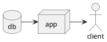

# Kramdown::PlantUml

[![Gem Version][gem-badge]][gem-url]
![Build][build-badge]
![No Java][no-java-build-badge]
![No PlantUML][no-plantuml-badge]
[![Codecov][codecov-badge]][codecov]
[![License][license-badge]][license]
[![Dependabot Status][dependabot-badge]][dependabot]
[![CLA assistant][cla-badge]][cla]
[![Contributor Covenant][coc-badge]][coc]

`kramdown-plantuml` allows you to use [PlantUML][plantuml] syntax within [fenced
code blocks][fenced] in [Kramdown][kramdown] ([Jekyll][jekyll]'s default
Markdown parser):

````md

````

Using the `plantuml` language identifier in fenced code blocks will allow
`kramdown-plantuml` to pick it up and replace it with a rendered [SVG][svg]
diagram when the Markdown is rendered to HTML. The above diagram will be
replaced with the following (abbreviated) HTML code:

```html
<div class="plantuml">
  <svg>
    <!-- Snip converted SVG code -->
  </svg>
</div>
```

Which in place will be rendered as the following:

![Rendered SVG Diagram][diagram-svg]

## Installation

Add this line to your application's Gemfile:

```ruby
gem 'kramdown-plantuml'
```

And then execute:

```sh
bundle install
```

Or install it yourself as:

```sh
gem install kramdown-plantuml
```

And then add the following to your Jekyll site's `_config.yml` file:

```yaml
plugins:
  - "kramdown-plantuml"
```

Then, `bundle exec jekyll build` or `bundle exec jekyll serve` will execute
`kramdown-plantuml`, converting code fenced PlantUML diagrams to beautiful
SVG.

## Requirements

`kramdown-plantuml` is dependent on the Java application [PlantUML][plantuml],
which in turn is dependent on [Graphviz][graphviz]. This means that both Java
and Graphviz need to be installed for `kramdown-plantuml` to work.

## Contributing

Bug reports and pull requests are welcome on [GitHub][github]. This project is
intended to be a safe, welcoming space for collaboration, and contributors are
expected to adhere to the [code of conduct][coc] and sign the
[contributor's license agreement][cla].

### Development

In order to do development on `kramdown-plantuml`, [clone] or [fork]
this repository, perform the changes you want and submit a [pull request][pr].

The easiest way to develop and test `kramdown-plantuml` is to add it as a
[Jekyll][jekyll] plugin installed from a local path in your `Gemfile`:

```ruby
gem 'kramdown-plantuml', path: 'path/to/kramdown-plantuml'
```

Every time you perform a change to `kramdown-plantuml`, you can then, within
the directory of your Jekyll site, do a `bundle install` to bring the changes
in and then start Jekyll up again afterwards with `bundle exec jekyll serve`.

#### Tests

A few tests are exercised with GitHub Actions every time code is pushed to the
repository on GitHub. You can execute these tests locally by first installing
all dependencies as such:

```shell
bundle install # Installs required Ruby Gems
bundle exec rake maven:install # Installs the PlantUML .jar file
```

And then to execute the tests you run the following:

```shell
bundle exec rake
```

## License

The code within this repository is available as open source under the terms of
the [Apache 2.0 License][license] and the [contributor's license
agreement][cla].

[build-badge]:          https://github.com/SwedbankPay/kramdown-plantuml/workflows/Ruby%20Gem/badge.svg?branch=main
[cla-badge]:            https://cla-assistant.io/readme/badge/SwedbankPay/kramdown-plantuml
[cla]:                  https://cla-assistant.io/SwedbankPay/kramdown-plantuml
[clone]:                https://docs.github.com/en/free-pro-team@latest/github/creating-cloning-and-archiving-repositories/cloning-a-repository
[coc-badge]:            https://img.shields.io/badge/Contributor%20Covenant-v2.0%20adopted-ff69b4.svg
[coc]:                  ./CODE_OF_CONDUCT.md
[codecov]:              https://codecov.io/gh/SwedbankPay/kramdown-plantuml/
[codecov-badge]:        https://codecov.io/gh/SwedbankPay/kramdown-plantuml/branch/main/graph/badge.svg?token=U3QJLVG3HY
[dependabot-badge]:     https://api.dependabot.com/badges/status?host=github&repo=SwedbankPay/kramdown-plantuml
[dependabot]:           https://dependabot.com
[diagram-svg]:          ./spec/examples/diagram.svg
[fenced]:               https://www.markdownguide.org/extended-syntax/#syntax-highlighting
[fork]:                 https://docs.github.com/en/free-pro-team@latest/github/getting-started-with-github/fork-a-repo
[gem-badge]:            https://badge.fury.io/rb/kramdown-plantuml.svg
[gem-url]:              https://rubygems.org/gems/kramdown-plantuml
[gems]:                 https://rubygems.org
[github]:               https://github.com/SwedbankPay/kramdown-plantuml/
[graphviz]:             https://graphviz.org/
[jekyll]:               https://jekyllrb.com/
[kramdown]:             https://kramdown.gettalong.org/
[license-badge]:        https://img.shields.io/github/license/SwedbankPay/kramdown-plantuml
[license]:              https://opensource.org/licenses/Apache-2.0
[no-java-build-badge]:  https://github.com/SwedbankPay/kramdown-plantuml/workflows/No%20Java/badge.svg?branch=main
[no-plantuml-badge]:    https://github.com/SwedbankPay/kramdown-plantuml/workflows/No%20PlantUML/badge.svg?branch=main
[plantuml]:             https://plantuml.com/
[pr]:                   https://docs.github.com/en/free-pro-team@latest/github/collaborating-with-issues-and-pull-requests/about-pull-requests
[svg]:                  https://developer.mozilla.org/en-US/docs/Web/SVG
