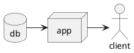
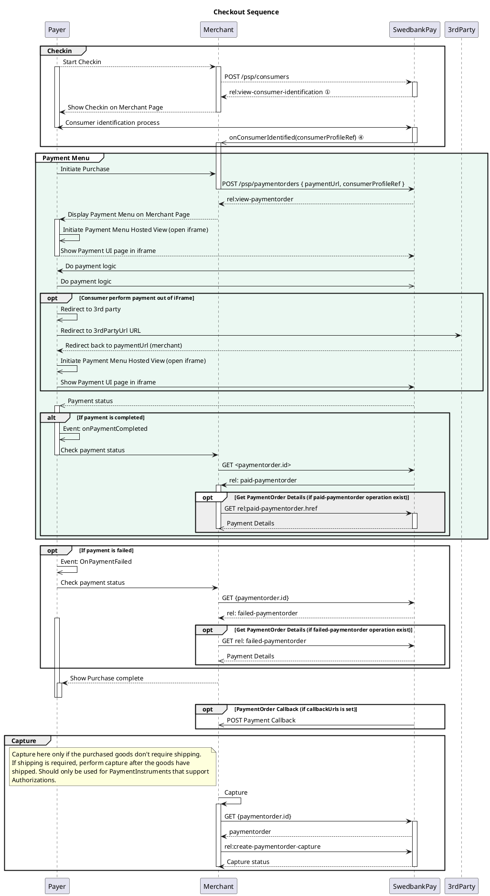

# This is a fixture

## Network diagram

```plantuml
@startuml Diagram
actor client
node app
database db
db -> app
app -> client
@enduml
```

## Sequence diagram

```plantuml
@startuml "Sequence"
    title "Checkout Sequence"

    group Checkin
        Payer --> Merchant: Start Checkin
        activate Payer
            activate Merchant
                Merchant --> SwedbankPay: POST /psp/consumers
                activate SwedbankPay
                    SwedbankPay --> Merchant: rel:view-consumer-identification ①
                deactivate SwedbankPay
                Merchant --> Payer: Show Checkin on Merchant Page
            deactivate Merchant

            SwedbankPay <-> Payer: Consumer identification process
        deactivate Payer

        activate SwedbankPay
            SwedbankPay ->> Merchant: onConsumerIdentified(consumerProfileRef) ④
        deactivate SwedbankPay
        activate Merchant
        deactivate Merchant
    end group

    group#fff #ebf8f2 Payment Menu
        Payer -> Merchant: Initiate Purchase
        deactivate Payer
        Merchant -> SwedbankPay: POST /psp/paymentorders { paymentUrl, consumerProfileRef }
        deactivate Merchant
        SwedbankPay --> Merchant: rel:view-paymentorder
        deactivate SwedbankPay
        Merchant --> Payer: Display Payment Menu on Merchant Page
        activate Payer
        Payer ->> Payer: Initiate Payment Menu Hosted View (open iframe)
        Payer --> SwedbankPay: Show Payment UI page in iframe
        deactivate Payer
        SwedbankPay -> Payer: Do payment logic
        deactivate SwedbankPay
        Payer ->> SwedbankPay: Do payment logic
        deactivate Payer

        opt Consumer perform payment out of iFrame
            Payer ->> Payer: Redirect to 3rd party
            Payer -> 3rdParty: Redirect to 3rdPartyUrl URL
            deactivate Payer
            3rdParty --> Payer: Redirect back to paymentUrl (merchant)
            deactivate 3rdParty
            Payer ->> Payer: Initiate Payment Menu Hosted View (open iframe)
            Payer -> SwedbankPay: Show Payment UI page in iframe
            deactivate Payer
        end

        SwedbankPay -->> Payer: Payment status

        alt If payment is completed
            activate Payer
            Payer ->> Payer: Event: onPaymentCompleted
            Payer -> Merchant: Check payment status
            deactivate Payer
            Merchant -> SwedbankPay: GET <paymentorder.id>
            deactivate Merchant
            SwedbankPay -> Merchant: rel: paid-paymentorder
            deactivate SwedbankPay
            opt#fff #eee Get PaymentOrder Details (if paid-paymentorder operation exist)
                activate Merchant
                    Merchant -> SwedbankPay: GET rel:paid-paymentorder.href
                    activate SwedbankPay
                        SwedbankPay -->> Merchant: Payment Details
                    deactivate SwedbankPay
                deactivate Merchant
            end
        end
    end group

    opt If payment is failed
        activate Payer
        Payer ->> Payer: Event: OnPaymentFailed
        Payer -> Merchant: Check payment status
        deactivate Payer
        Merchant -> SwedbankPay: GET {paymentorder.id}
        deactivate Merchant
        SwedbankPay --> Merchant: rel: failed-paymentorder

        deactivate SwedbankPay
        opt Get PaymentOrder Details (if failed-paymentorder operation exist)
            activate Payer
            deactivate Payer
            Merchant -> SwedbankPay: GET rel: failed-paymentorder
            deactivate Merchant
            SwedbankPay -->> Merchant: Payment Details
            deactivate SwedbankPay
        end
    end

    activate Merchant
    Merchant --> Payer: Show Purchase complete
    opt PaymentOrder Callback (if callbackUrls is set)
        activate Payer
        deactivate Payer
            SwedbankPay ->> Merchant: POST Payment Callback
    end

    group Capture
        note left of Merchant
            Capture here only if the purchased goods don't require shipping.
            If shipping is required, perform capture after the goods have
            shipped. Should only be used for PaymentInstruments that support
            Authorizations.
        end note

        Merchant -> Merchant: Capture
        activate Merchant
            Merchant -> SwedbankPay: GET {paymentorder.id}
            activate SwedbankPay
                SwedbankPay --> Merchant: paymentorder
                Merchant -> SwedbankPay: rel:create-paymentorder-capture
                SwedbankPay --> Merchant: Capture status
            deactivate SwedbankPay
        deactivate Merchant
    end group
@enduml
```
